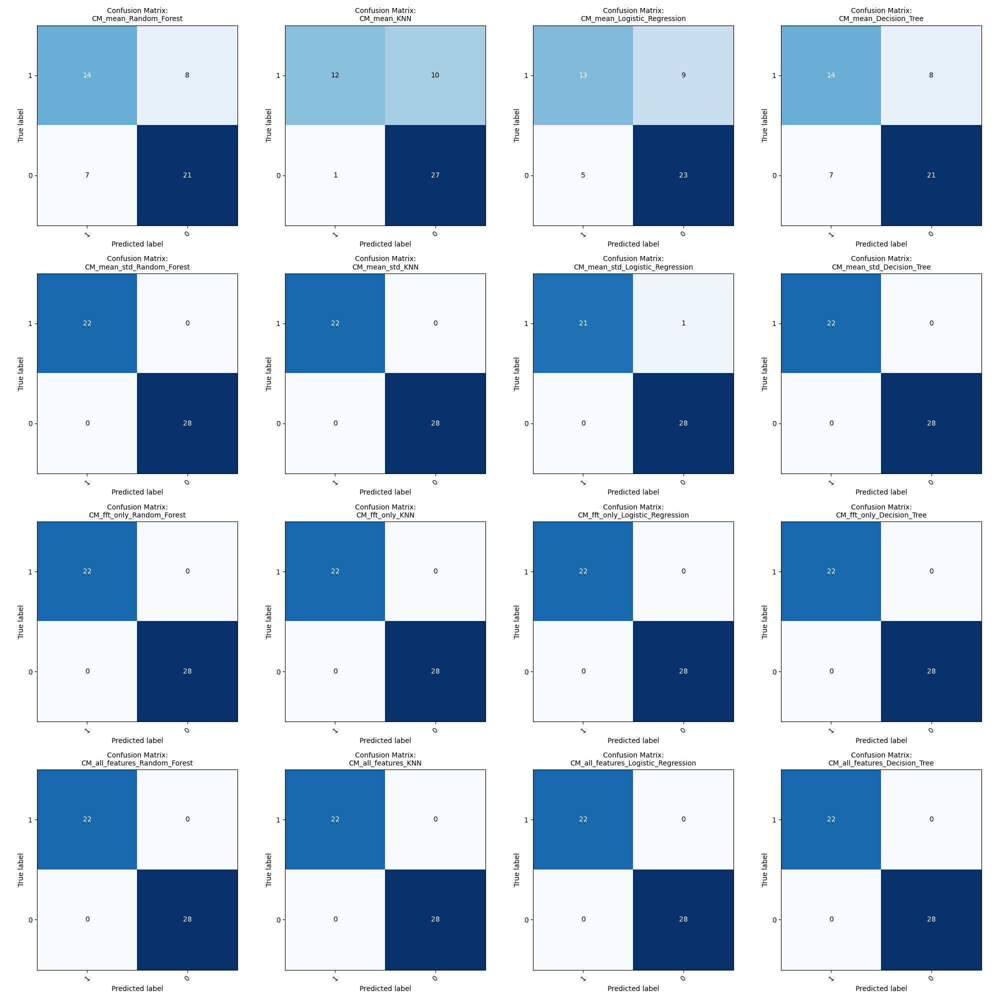

# Bericht Jan Naidr, Cornelius Brandt, Mats Schulte
Die Messages des MQTT Servers werden mittels paho-mqtt ausgelesen. Die von den verschiedenen Topics empfangenen Messages werden dann nach Topic sortiert und mittels TinyDB in eine database.json Datei abgespeichert. Mit visualizer.py kann ein Plot des Temperaturverlaufs des roten Dispensers erstellt werden. Diese Datei kann aber auf jede beliebige Datenreihe umgeschrieben werden.  

## Linear Regression Model

Durch das Skript lin_reg.py kann ein Linear Regression Modell mit den Daten aus database.json trainiert werden, um die Größe `final_weight` vorherzusagen.

| Genutzte Spalten         | Modelltyp           | MSE-Wert (Training) | MSE-Wert(Test) |
|--------------------------|---------------------|---------------------|-----------------|
|`vibration index red`, ``fill level grams red``, ``vibration index green``, ``fill level grams green``, ``vibration index blue``, ``fill level grams blue``, ``temperature red``, ``temperature green``, ``temperature blue`` | Lineare Regression  | 0.071|0.1002 |

### Formel für das Modell

final_weight = 0.09026261 * vibration_index_red + 0.00102775 * fill_level_grams_red + 0.09996379 * vibration_index_green + 0.00056406 * fill_level_grams_green + 0.09822221 * virbration_index_blue + 0.00036188 * fill_level_grams_blue + 0.17195129 * temperature_red - 0.00784363 * temperature_green - 0.03339488 * temperature_blue

### Ergebnis
In der Datei [reg_52315859-52316593-52315878.csv](reg_52315859-52316593-52315878.csv) Datei können die Ergebnisse der Linearen Regression für den Datensatz in X.csv eingesehen werden

## Klassifikation defekter Flaschen
Zur Erkennung defekter Flaschen wurde ein Klassifikationsmodell auf Basis von Zeitreihendaten (Drop Vibration) entwickelt. Dabei kamen verschiedene Features wie Mittelwert, Standardabweichung und Frequenzkomponenten (10Hz, 20Hz) zum Einsatz. Die nachfolgende Tabelle fasst die Modellgüte (F1-Scores) für verschiedene Feature-Kombinationen zusammen:

| Genutzte Features             | Modell-Typ          |   F1-Score (Training) |   F1-Score (Test) |
|:------------------------------|:--------------------|----------------------:|------------------:|
| mean                          | Random Forest       |                 1     |             0.737 |
| mean                          | KNN                 |                 0.85  |             0.831 |
| mean                          | Logistic Regression |                 0.726 |             0.767 |
| mean                          | Decision Tree       |                 1     |             0.737 |
| mean, std                     | Random Forest       |                 1     |             1     |
| mean, std                     | KNN                 |                 1     |             1     |
| mean, std                     | Logistic Regression |                 0.99  |             0.982 |
| mean, std                     | Decision Tree       |                 1     |             1     |
| fft_10Hz, fft_20Hz            | Random Forest       |                 1     |             1     |
| fft_10Hz, fft_20Hz            | KNN                 |                 1     |             1     |
| fft_10Hz, fft_20Hz            | Logistic Regression |                 1     |             1     |
| fft_10Hz, fft_20Hz            | Decision Tree       |                 1     |             1     |
| mean, std, fft_10Hz, fft_20Hz | Random Forest       |                 1     |             1     |
| mean, std, fft_10Hz, fft_20Hz | KNN                 |                 1     |             1     |
| mean, std, fft_10Hz, fft_20Hz | Logistic Regression |                 1     |             1     |
| mean, std, fft_10Hz, fft_20Hz | Decision Tree       |                 1     |             1     |

### Vorgehen zur Klassifikation defekter Flaschen

Zunächst wurden die Zeitreihendaten mit [`plot_data.py`](Aufgabe_4/plot_data.py) visualisiert, um einen ersten Eindruck von den Drop-Oszillationen der Flaschen zu gewinnen. Dabei zeigte sich ein klares Muster zwischen intakten und defekten Flaschen.

Anschließend wurden die Flaschen mit [`label_bottles.py`](Aufgabe_4/label_bottles.py) manuell gelabelt. Für jede Flasche wurde anhand des Plots entschieden, ob sie intakt oder defekt ist.

Im nächsten Schritt erfolgte die Klassifikation mit [`defekte_flaschen_klassifikation.py`](Aufgabe_4/defekte_flaschen_klassifikation.py). Hierbei wurden verschiedene Modelle und Feature-Kombinationen getestet und die Ergebnisse in Form von Konfusionsmatrizen und Tabellen dokumentiert.

